I build AI inference infrastructure and container runtimes, from WGSL compute kernels
to distributed GPU clusters, with side quests in binary reverse engineering.

## 🧠 AI inference, down to the metal

- [**agave**](https://github.com/maci0/agave): LLM inference engine written from scratch in Zig, no Python runtime, no framework tax
- [**beam**](https://github.com/maci0/beam): Ray's API reimplemented in ~1,400 lines of pure Python, enough to run vLLM multi-node. NVIDIA and AMD, validated cross-node
- [**vllm-webgpu**](https://github.com/maci0/vllm-webgpu): vLLM platform plugin targeting WebGPU: WGSL compute kernels instead of CUDA
- [**muninn-sidecar**](https://github.com/maci0/muninn-sidecar): Persistent memory for AI agents, shipped as a Go sidecar
- [**gpustack-modelsync**](https://github.com/maci0/gpustack-modelsync): Declarative model placement across GPU cluster nodes
- [**gb10-thermal-toolkit**](https://github.com/maci0/gb10-thermal-toolkit): Thermal-driven GPU clock governor for NVIDIA DGX Spark, fixes the under-load power-off

## 🕹️ Reverse engineering

- [**rebrew**](https://github.com/maci0/rebrew): Compiler-in-the-loop decompilation workbench for binary-matching reversing
- [**europa1400-networkfix**](https://github.com/maci0/europa1400-networkfix): Fixed multiplayer in a 2001 game the vendor abandoned
- [**openmiles**](https://github.com/maci0/openmiles): Open reimplementation of the Miles Sound System

## ⚙️ Runtimes and clusters

- [**katamaran**](https://github.com/maci0/katamaran): Live migration for Kata Containers
- [**vmetal-openshift**](https://github.com/maci0/vmetal-openshift): Virtual baremetal OpenShift lab: Redfish BMC emulation, bonded NICs, split-DNS, one Ansible topology

*Zig for things that must be fast, Python for things that must exist by Friday.*

<picture>
  <source media="(prefers-color-scheme: dark)" srcset="https://raw.githubusercontent.com/maci0/maci0/output/github-snake-dark.svg" />
  
</picture>

